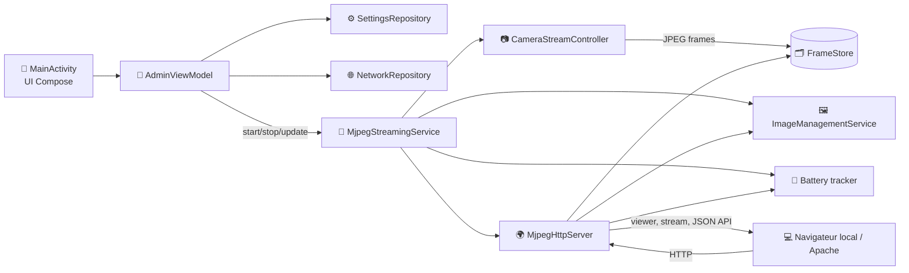
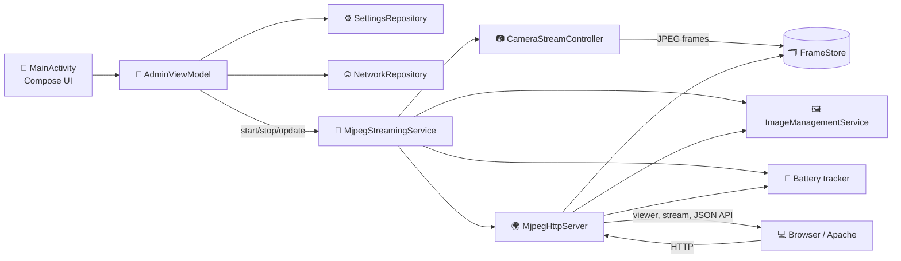

# 📷 CameraMjpeg

-3DDC84?logo=android&logoColor=white)


> [!NOTE]
> **🏷️ FR · Vue d'ensemble**
> Application Android de streaming caméra en **MJPEG** avec **serveur HTTP embarqué**. Le téléphone capture les images, les compresse en JPEG, puis les expose sur le réseau local via un viewer web, un flux brut et plusieurs endpoints JSON utiles au monitoring.

> [!TIP]
> **🏷️ FR · Accès rapide**
> - Viewer : `GET /`, `GET /viewer`, `GET /monitor`
> - Flux MJPEG : `GET /stream.mjpeg`
> - Snapshot : `GET /snapshot.jpg`
> - Batterie : `GET /api/battery`
> - Statut : `GET /api/status`

> [!IMPORTANT]
> **🏷️ FR · Fonctionnalités**
> - 📡 Streaming MJPEG depuis le téléphone Android via `GET /stream.mjpeg`
> - 🖥️ Viewer web intégré sur `GET /`, `GET /viewer` et `GET /monitor`
> - 🎛️ Interface admin Compose : démarrage/arrêt, port, qualité JPEG, caméra avant/arrière, mode veille
> - 🌐 Détection réseau : Wi-Fi, SSID, IP locale, URL viewer, URL flux, URL batterie
> - 🔋 Monitoring batterie temps réel avec `isCharging`, température et timestamp
> - 🧠 Service foreground `MjpegStreamingService` avec WakeLock CPU optionnel

> [!NOTE]
> **🏷️ FR · Architecture dessinée**
> **Flux réel dans le code** : `AdminViewModel` démarre `MjpegStreamingService`, le service initialise `CameraStreamController`, publie les JPEG dans `FrameStore`, puis `MjpegHttpServer` sert le viewer, le flux MJPEG, les snapshots, les métriques et l'API batterie.



> [!TIP]
> **🏷️ FR · SDK & compatibilité Android**
> Configuration actuelle dans `app/build.gradle.kts` :
> - `versionName`: `1.0`
> - `versionCode`: `1`
> - `minSdk`: `28` (Android 9.0+)
> - `targetSdk`: `36` (Android 14)
> - `compileSdk`: `36` (Android 14)
> - Java/Kotlin JVM target : `11`

> [!IMPORTANT]
> **🏷️ FR · Permissions manifest**
> Permissions principales présentes dans `app/src/main/AndroidManifest.xml` :
> - `android.permission.CAMERA`
> - `android.permission.INTERNET`
> - `android.permission.ACCESS_NETWORK_STATE`
> - `android.permission.ACCESS_WIFI_STATE`
> - `android.permission.ACCESS_FINE_LOCATION`
> - `android.permission.ACCESS_COARSE_LOCATION`
> - `android.permission.POST_NOTIFICATIONS`
> - `android.permission.WAKE_LOCK`
> - `android.permission.FOREGROUND_SERVICE`
> - `android.permission.FOREGROUND_SERVICE_CAMERA`

> [!NOTE]
> **🏷️ FR · Endpoints HTTP**
>
> **Pages**
> - `GET /` → page monitoring/viewer
> - `GET /viewer` → page monitoring/viewer
> - `GET /monitor` → page monitoring/viewer
>
> **Flux & snapshots**
> - `GET /stream.mjpeg` → flux MJPEG multipart
> - `GET /snapshot.jpg` → image JPEG instantanée
> - `GET /favicon.ico` → favicon PNG du viewer
>
> **API JSON**
> - `GET /api/status` → statut serveur/stream
> - `GET /api/battery` → batterie temps réel

### Exemple `GET /api/battery`

```json
{
  "ok": true,
  "levelPercent": 82,
  "isCharging": true,
  "temperatureC": 31.4,
  "timestampMs": 1773571200000
}
```

> [!TIP]
> **🏷️ FR · Usage rapide**
> 1. Installer et lancer l'application sur le téléphone.
> 2. Donner les permissions caméra/localisation demandées.
> 3. Dans l'admin, vérifier ou modifier le port puis appuyer sur **Démarrer**.
> 4. Récupérer l'IP locale affichée dans la section réseau.
> 5. Ouvrir un navigateur sur le même réseau :
>    - `http://<ip-telephone>:<port>/` pour le monitoring
>    - `http://<ip-telephone>:<port>/stream.mjpeg` pour le flux brut
> 6. Vérifier l'API batterie sur `http://<ip-telephone>:<port>/api/battery`.

> [!IMPORTANT]
> **🏷️ FR · Exemple Apache VirtualHost vers l'IP locale du téléphone**
> Utilisez l'IP locale affichée par l'application, par exemple `192.168.1.50:8080`.
>
> **Option A — redirection simple vers l'IP locale**
>
> ```apache
> <VirtualHost *:80>
>     ServerName camera.example.local
>
>     Redirect "/" "http://192.168.1.50:8080/"
> </VirtualHost>
> ```
>
> **Option B — reverse proxy complet recommandé**
>
> ```apache
> # Modules utiles : proxy proxy_http headers rewrite
> <VirtualHost *:80>
>     ServerName camera.example.local
>
>     ProxyPreserveHost On
>     ProxyRequests Off
>
>     RequestHeader set X-Forwarded-Proto "http"
>     RequestHeader set X-Forwarded-Host "camera.example.local"
>
>     ProxyPass        /stream.mjpeg  http://192.168.1.50:8080/stream.mjpeg retry=0 connectiontimeout=5 timeout=300 keepalive=On
>     ProxyPassReverse /stream.mjpeg  http://192.168.1.50:8080/stream.mjpeg
>
>     ProxyPass        /snapshot.jpg  http://192.168.1.50:8080/snapshot.jpg
>     ProxyPassReverse /snapshot.jpg  http://192.168.1.50:8080/snapshot.jpg
>
>     ProxyPass        /favicon.ico   http://192.168.1.50:8080/favicon.ico
>     ProxyPassReverse /favicon.ico   http://192.168.1.50:8080/favicon.ico
>
>     ProxyPass        /api/          http://192.168.1.50:8080/api/
>     ProxyPassReverse /api/          http://192.168.1.50:8080/api/
>
>     ProxyPass        /              http://192.168.1.50:8080/
>     ProxyPassReverse /              http://192.168.1.50:8080/
> </VirtualHost>
> ```
>
> **URL exposées par Apache** :
> - `http://camera.example.local/`
> - `http://camera.example.local/stream.mjpeg`
> - `http://camera.example.local/snapshot.jpg`
> - `http://camera.example.local/api/status`
> - `http://camera.example.local/api/battery`

> [!NOTE]
> **🏷️ FR · Endpoints utiles en usage**
> - Viewer : `http://<ip-telephone>:<port>/`, `http://<ip-telephone>:<port>/viewer`, `http://<ip-telephone>:<port>/monitor`
> - Flux : `http://<ip-telephone>:<port>/stream.mjpeg`
> - Snapshot : `http://<ip-telephone>:<port>/snapshot.jpg`
> - Favicon : `http://<ip-telephone>:<port>/favicon.ico`
> - Status JSON : `http://<ip-telephone>:<port>/api/status`
> - Batterie JSON : `http://<ip-telephone>:<port>/api/battery`

> [!TIP]
> **🏷️ FR · Build local**

```powershell
Set-Location "D:\PATH\TO\CameraMjpeg"
.\gradlew.bat :app:assembleDebug
```

Installation debug ciblée sur un device ADB :

```powershell
$apk = "D:\PATH\TO\CameraMjpeg\app\build\intermediates\apk\debug\app-debug.apk"
adb devices
adb -s <device-serial> install -r $apk
```

> [!WARNING]
> **🏷️ FR · Notes d'usage & vérification README**
> - Le titre HTML du viewer utilise dynamiquement le modèle du téléphone.
> - Si `INSTALL_FAILED_USER_RESTRICTED` apparaît : activer **Installation via USB** dans les options développeur.
> - Si `INSTALL_FAILED_OLDER_SDK` apparaît : le téléphone est en dessous de `minSdk 24`.
> - Vérifier après édition : rendu des callouts, affichage du diagramme Mermaid, cohérence de l'IP/port Apache, et exactitude des endpoints documentés.

---

## 🌍 English (EN)

> [!NOTE]
> **🏷️ EN · Overview**
> Android app for **MJPEG camera streaming** with an **embedded HTTP server**. The phone captures frames, compresses them to JPEG, and exposes a local web viewer, raw stream, snapshots, and JSON monitoring endpoints.

> [!TIP]
> **🏷️ EN · Quick access**
> - Viewer: `GET /`, `GET /viewer`, `GET /monitor`
> - MJPEG stream: `GET /stream.mjpeg`
> - Snapshot: `GET /snapshot.jpg`
> - Battery: `GET /api/battery`
> - Status: `GET /api/status`

> [!IMPORTANT]
> **🏷️ EN · Features**
> - 📡 MJPEG streaming from the Android phone via `GET /stream.mjpeg`
> - 🖥️ Built-in viewer on `GET /`, `GET /viewer`, and `GET /monitor`
> - 🎛️ Compose admin UI: start/stop, port, JPEG quality, front/rear camera, keep-awake mode
> - 🌐 Network detection: Wi-Fi, SSID, local IP, viewer URL, stream URL, battery API URL
> - 🔋 Real-time battery monitoring with charging state, temperature, and timestamp
> - 🧠 Foreground service `MjpegStreamingService` with optional CPU WakeLock

> [!NOTE]
> **🏷️ EN · Architecture diagram**



> [!TIP]
> **🏷️ EN · Android SDK & compatibility**
> Current configuration in `app/build.gradle.kts`:
> - `versionName`: `1.0`
> - `versionCode`: `1`
> - `minSdk`: `28` (Android 9.0+)
> - `targetSdk`: `36` (Android 14)
> - `compileSdk`: `36` (Android 14)
> - Java/Kotlin JVM target: `11`

> [!IMPORTANT]
> **🏷️ EN · Manifest permissions**
> Main permissions declared in `app/src/main/AndroidManifest.xml`:
> - `android.permission.CAMERA`
> - `android.permission.INTERNET`
> - `android.permission.ACCESS_NETWORK_STATE`
> - `android.permission.ACCESS_WIFI_STATE`
> - `android.permission.ACCESS_FINE_LOCATION`
> - `android.permission.ACCESS_COARSE_LOCATION`
> - `android.permission.POST_NOTIFICATIONS`
> - `android.permission.WAKE_LOCK`
> - `android.permission.FOREGROUND_SERVICE`
> - `android.permission.FOREGROUND_SERVICE_CAMERA`

> [!NOTE]
> **🏷️ EN · HTTP endpoints**
> - Pages: `GET /`, `GET /viewer`, `GET /monitor`
> - Stream: `GET /stream.mjpeg`
> - Snapshot: `GET /snapshot.jpg`
> - Favicon: `GET /favicon.ico`
> - JSON: `GET /api/status`, `GET /api/battery`

### Example `GET /api/battery`

```json
{
  "ok": true,
  "levelPercent": 82,
  "isCharging": true,
  "temperatureC": 31.4,
  "timestampMs": 1773571200000
}
```


> [!TIP]
> **🏷️ EN · Quick start**
> 1. Install and launch the app on the phone.
> 2. Grant the requested camera/location permissions.
> 3. In the admin screen, verify or change the port, then tap **Start**.
> 4. Copy the local IP displayed in the network section.
> 5. Open a browser on the same network:
>    - `http://<phone-ip>:<port>/`
>    - `http://<phone-ip>:<port>/stream.mjpeg`
> 6. Check battery status on `http://<phone-ip>:<port>/api/battery`.

> [!IMPORTANT]
> **🏷️ EN · Apache VirtualHost example to the phone local IP**
> Replace `192.168.1.50:8080` with the local address shown in the app.
>
> ```apache
> <VirtualHost *:80>
>     ServerName camera.example.local
>
>     ProxyPreserveHost On
>     ProxyRequests Off
>
>     ProxyPass        /stream.mjpeg  http://192.168.1.50:8080/stream.mjpeg retry=0 connectiontimeout=5 timeout=300 keepalive=On
>     ProxyPassReverse /stream.mjpeg  http://192.168.1.50:8080/stream.mjpeg
>
>     ProxyPass        /api/          http://192.168.1.50:8080/api/
>     ProxyPassReverse /api/          http://192.168.1.50:8080/api/
>
>     ProxyPass        /              http://192.168.1.50:8080/
>     ProxyPassReverse /              http://192.168.1.50:8080/
> </VirtualHost>
> ```

> [!TIP]
> **🏷️ EN · Local build**

```powershell
Set-Location "D:\PATH\TO\CameraMjpeg"
.\gradlew.bat :app:assembleDebug
```

Debug install on a specific ADB device:

```powershell
$apk = "D:\PATH\TO\CameraMjpeg\app\build\intermediates\apk\debug\app-debug.apk"
adb devices
adb -s <device-serial> install -r $apk
```

> [!WARNING]
> **🏷️ EN · Usage notes**
> - The viewer HTML title uses dynamic phone model detection.
> - If `INSTALL_FAILED_USER_RESTRICTED` appears, enable **Install via USB** in Developer options.
> - If `INSTALL_FAILED_OLDER_SDK` appears, the device is below `minSdk 24`.

> [!IMPORTANT]
> **🏷️ FR · Services foreground**
> - Le service foreground caméra est déclaré dans le manifest :
> ```xml
> <service
>     android:name=".service.CameraForegroundService"
>     android:enabled="true"
>     android:exported="false"
>     android:foregroundServiceType="camera" />
> ```
> - Il est démarré automatiquement par MainActivity lors du lancement de l'application.
> - Il garantit la persistance du streaming MJPEG même en arrière-plan.

---

> [!INFO]
> **🏷️ FR · Mode Android IDE**
> Si l'IDE affiche le projet en mode "Projet" au lieu de "Android" :
> - Ouvrez le projet depuis le dossier racine `CameraMjpeg`.
> - Vérifiez la présence de `build.gradle.kts` et du dossier `app/`.
> - Cliquez sur "File" > "Sync Project with Gradle Files".
> - Si besoin, fermez puis rouvrez le projet.
> - Le mode "Android" doit apparaître dans la barre latérale.
>
> **🏷️ EN · Android IDE Mode**
> If the IDE shows the project in "Project" mode instead of "Android":
> - Open the project from the root folder `CameraMjpeg`.
> - Check for `build.gradle.kts` and the `app/` folder.
> - Click "File" > "Sync Project with Gradle Files".
> - If needed, close and reopen the project.
> - The "Android" mode should appear in the sidebar.
